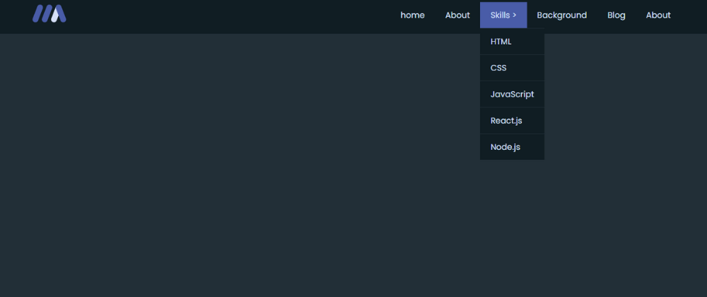
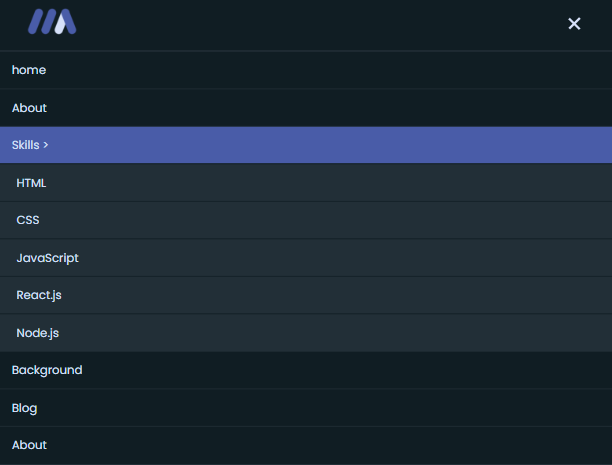

# Create a Dropdown Menu Using HTML, CSS and JavaScript

Hey there, fellow coders! Today, we're embarking on a journey to create a fully responsive dropdown menu using HTML, CSS, and JavaScript. Our goal? To showcase a sleek and versatile dropdown menu that adapts seamlessly to different screen sizes, enhancing user experience without the need for extensive tutorials.

## Overview:
In this project showcase, we'll dive into the creation of a dropdown menu that's not just visually appealing but also functional across various devices. By leveraging HTML for structure, CSS for styling, and JavaScript for interactivity, we'll craft a dynamic menu that reflects modern web design principles.

## Key Highlights:
HTML Structure: We'll lay the groundwork with HTML, structuring our navbar and dropdown menu components to create a solid foundation for our project.
CSS Styling: With CSS, we'll add style and finesse to our dropdown menu, ensuring it looks polished and professional on any screen.
JavaScript Functionality: Using JavaScript, we'll inject interactivity into our dropdown menu, allowing users to seamlessly navigate their way through our site.

## Let's Dive In:
From its humble beginnings in HTML to its stylish makeover with CSS and JavaScript magic, we'll showcase the evolution of our menu in action.

## Dropdown Menu Html Code:

```html
<!DOCTYPE html>
<html lang="en">
<head>
    <meta charset="UTF-8">
    <meta name="viewport" content="width=device-width, initial-scale=1.0">
    <title>Drop Down Menu</title>
    <link rel="stylesheet" href="styles.css">
</head>
<body>
    <nav class="navbar">
        <div class="logo">
            
        </div>
        <div class="toggle-btn">
            <div class="icon"></div>
        </div>
        <ul class="menu">
            <li><a href="#">home</a></li>
            <li><a href="#">About</a></li>
            <li class="submenu-wrapper">
                <a href="#">Skills<span> > </span>
                </a>
                <ul class="submenu">
                    <li><a href="#">HTML</a></li>
                    <li><a href="#">CSS</a></li>
                    <li><a href="#">JavaScript</a></li>
                    <li><a href="#">React.js</a></li>
                    <li><a href="#">Node.js</a></li>
                </ul>
            </li>
            <li><a href="#">Background</a></li>
            <li><a href="#">Blog</a></li>
            <li><a href="#">About</a></li>
        </ul>
    </nav>
    <script src="./script.js"></script>
</body>
</html>
```
## Dropdown Menu CSS Code:

```css
@import url('https://fonts.googleapis.com/css2?family=Poppins:ital,wght@0,100;0,200;0,300;0,400;0,500;0,600;0,700;0,800;0,900;1,100;1,200;1,300;1,400;1,500;1,600;1,700;1,800;1,900&display=swap');

*,
::before,
::after{
    padding: 0;
    margin: 0;
    box-sizing: border-box;
}

html{
    font-size:13px;
}

body{
    font-family: "Poppins", sans-serif;
    font-size:1rem;
    background: #222f37;
    color:#d6e0f9;
}

.navbar{
    width:100%;
    position:fixed;
    top:0;
    left:0;
    background: #101d23;
    padding:0 5%;
    display:flex;
    align-items: center;
    justify-content: space-between;
}

.logo{
    width:5rem
}

.logo img{
    width:100%;
}

.menu{
    list-style: none;
}

.menu li{
    position: relative;
    float:left;
}

.menu li a{
    font-family: "Poppins", sans-serif;
    font-size:1.2rem;
    color:#d6e0f9;
    display:block;
    text-decoration: none;
    padding:1rem 1.5rem;
}

.menu li a:hover{
    background: #495ca8;
}

.submenu{
    position: absolute;
    left:0;
    background: #101d23;
    display:none;
    transition: all .3s ease-in-out;
}

.submenu-wrapper:hover .submenu,
.submenu-wrapper:focus-within .submenu{
    display: initial;
}

.submenu li{
    width:100%;
    border-top:.1rem solid #222f37;
    list-style: none;
}

.toggle-btn {
    display: none; /* Initially hide the toggle button */
    z-index:1000;
}

.icon {
    position: relative;
    width: 1.5rem;
    height: .8rem;
    cursor: pointer;
    z-index:100;
}

.icon::before {
    top: 0;
    right:0;
    content: '';
    position: absolute;
    width: 2rem;
    height: .2rem;
    background-color: #d6e0f9;
    transition: all 0.3s ease-in-out;
}

.icon::after {
    bottom: 0;
    right:0;
    content: '';
    position: absolute;
    width: 1.5rem;
    height: .2rem;
    background-color: #d6e0f9;
    transition: transform 0.3s ease-in-out;
}

/* Rotate the before and after lines to create the close icon effect */
.icon.active::before {
    width:1.5rem;
    transform: rotate(-45deg) translate(-0.21rem, 0.21rem);
}

.icon.active::after {
    transform: rotate(45deg) translate(-0.21rem, -0.21rem);
}


@media (max-width: 991px){
    .toggle-btn{
        display: block;
    }

    .menu{
        width:100%;
        position:absolute;
        top:100%;
        left:0;
        background: #101d23;
        border-top: .1rem solid #222f37;
        display:none;
    }

    .menu.active{
        display:initial
    }

    .menu li{
        width:100%;
        border-top: .1rem solid #222f37;
    }

    .submenu{
        position: relative;
        width:100%;
    }

    .submenu li{
        background: #222f37;
        border-top: .1rem solid #101d23;
    }

    .submenu li a{
        padding-left:2rem;
    }
}
```

## Dropdown Menu JavaScript Code:

```javascript

    const icon = document.querySelector('.icon');
    const menu = document.querySelector('.menu');
    const span = document.querySelector('.span')

    function toggleNavbar() {
        menu.classList.toggle('active');
        icon.classList.toggle('active');
    }

    document.querySelector('.toggle-btn').addEventListener('click', function () {
        toggleNavbar();
    });
```

## On Large Screens


## On Small Screens

